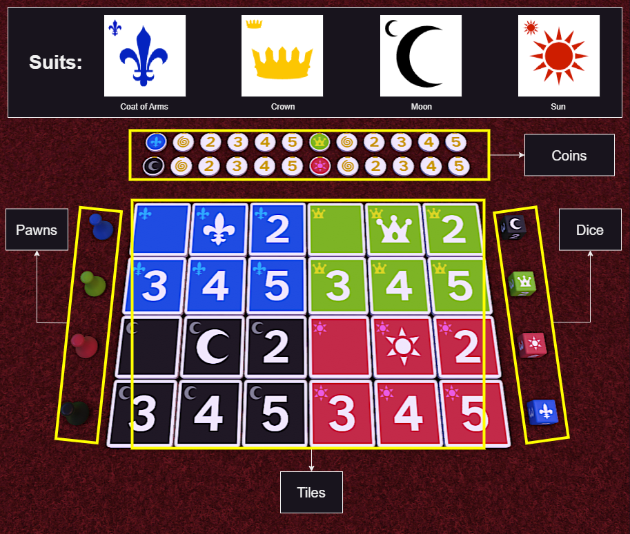
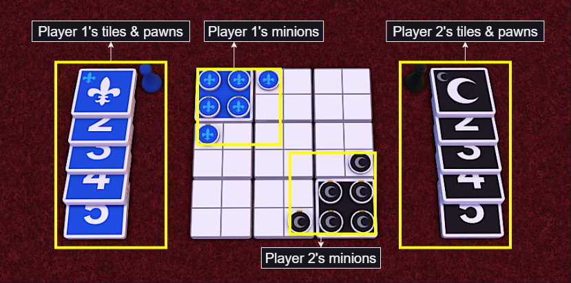
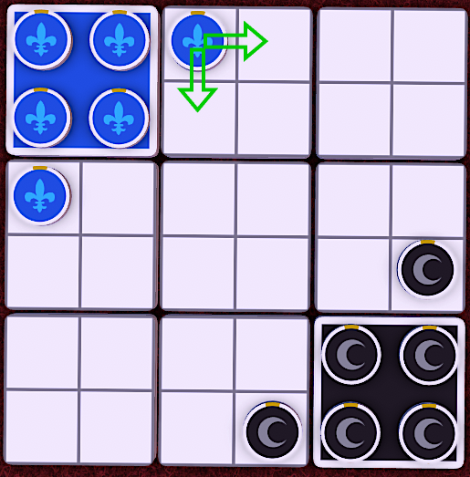
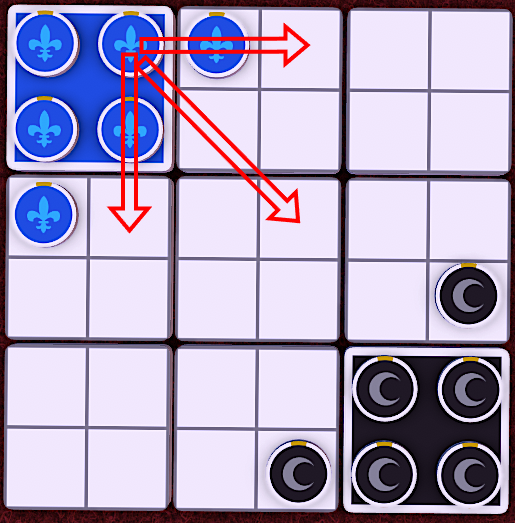
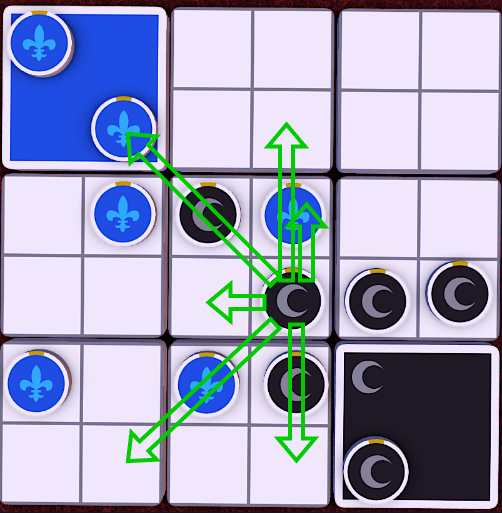
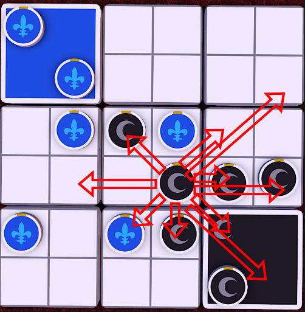
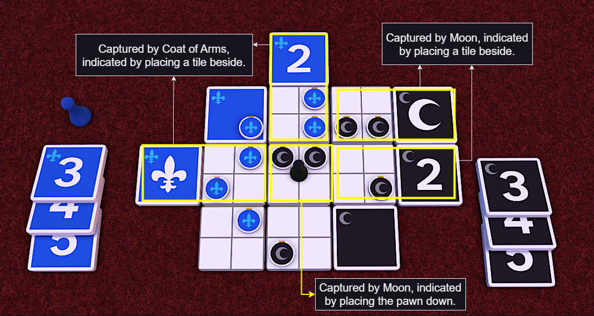

**Designers**: Lu Bolin, Teng Yan Zhen, Julia Kwek 
**Players:** 2 
**Ages:** 10+ 
**Game Length:** ~5–10 minutes 
**Equipment:** Standard Piecepack set

## Overview
Expansion is a two-player territory-control strategy game. Each player commands an army of "minions" represented by coins from a chosen suit. The objective is to expand your control across a shared square grid of tiles by capturing territory and defeating your opponent's forces through tactical movement and combat.

## Objective

To win, capture more tiles than your opponent by strategically moving and fighting with your minions.

## Equipment

Expansion requires 1 standard Piecepack as the only equipment.

A standard **Piecepack** consists of:

<ul>
  <li>4 <strong>suits</strong>: <em>Coat of Arms</em>, <em>Crown</em>, <em>Moon</em>, and <em>Sun</em>.</li>
  <li>Each suit contains:
    <ul>
      <li>6 <strong>tiles</strong> (each has a value face and a grid face divided into 4 cells)</li>
      <li>6 <strong>coins</strong> (values: blank, ace (1), 2, 3, 4, 5)</li>
      <li>1 <strong>pawn</strong></li>
      <li>1 <strong>die</strong> (faces: blank, ace, 2, 3, 4, 5)</li>
    </ul>
  </li>
</ul>

> **Note:** Tile and coin values are not used for setup but are revealed during combat.

*Figure 1. A Standard Piecepack.*

## Setup

### 1. Choose Suits

Select two suits. Each player takes one suit.

### 2. Build the Board

Each player takes **1 tile** from their chosen suit and **7 tiles** from the unused suits. Arrange the 9 tiles into a **3×3 grid**:

- Each player's starting tile (their own suit) goes in opposite corners, grid-side down.
- All other tiles are grid-side up.

Keep the remaining tiles of each chosen suit aside for later use (to mark captured tiles).

### 3. Place Minions

Each player places their **6 coins (minions)** suit-side up, forming a **triangle** in their respective corner:
- 4 coins on their starting tile.
- 2 coins on adjacent edge cells.

> Players should remember each coin's numeric value but cannot peek once play begins.

*Figure 2. Initial Setup.*

### 4. Determine First Player

Both players roll their dice. Higher number goes first (5 > 4 > 3 > 2 > ace > blank).
Re-roll if tied.
The first player's **first move must be a walk**, not a jump (refer to **movement** section).

## Gameplay

Players alternate turns.
Each turn, a player **must move exactly one minion**.
Movement may trigger **combat** and/or **tile capturing**.

### Movement

A minion can move in one of two ways:
1. **Walk:** Move 1 cell up, down, left, or right.
2. **Jump:** Leap over 1 occupied cell (straight or diagonal).
    - The jumped-over cell must contain exactly **1 minion** (of either player).
    - The destination cell must be **either empty or occupied by an enemy minion**.
    - You **cannot** jump over empty spaces or land on friendly minions.

> On the first move (not first turn) of the game, jumping is not allowed.

::::columns
:::column
**First player's first move**

*(a) First move: legal*

*(c) First move: illegal*
:::

:::column
**All subsequent moves**

*(b) Subsequent moves: legal*

*(d) Subsequent moves: illegal*
:::
::::

*Figure 3. Comparison of legal (green arrows) and illegal (red arrows) moves for the first move and subsequent moves.*

### Combat

Combat occurs when a minion moves onto a cell occupied by an enemy minion.
1. Both minions' coin values are revealed.
2. The lower-value minion is removed.
3. If tied, both are removed.
4. **Ace rule:** Ace acts as a wildcard -- both are removed (1-for-1 trade).

Surviving minions are flipped back suit-side up.

### Capturing Tiles

A tile is **captured** when a player has at least **two more minions** on that tile than the opponent.

Examples:
- 2:0 → captured
- 3:1 → captured
- 1:0 or 2:1 → not captured

Once captured, tiles **cannot be recaptured**.
Mark captured tiles using:
- A spare tile of the player's suit placed beside it, or
- The capturing player's pawn placed on the center tile if it is captured.

> Corner tiles begin captured since they start with 4 minions.

*Figure 4. Capture Indicator Illustration.*

### Ending the Game

The game ends when **any** of the following occur:
1. A player has captured **4 additional tiles** (5 total with starting tile).
2. Neither player can capture more tiles (e.g., too few minions or agreed stalemate).
3. The same board configuration appears **three times** (similar to Chess's threefold repetition rule).

### Winning

The player who controls the most captured tiles wins.
**Tiebreakers:**
1. Player who captured the center tile wins.
2. If neither did, the **second player** wins.

## Download

[Download the complete game instructions (PDF)](/downloads/expansion-piecepack/instructions.pdf)

## License

© 2025 Lu Bolin
Developed as part of the NM4260 "Game Design" module, National University of Singapore.
Developed under the guidance of Dr. Dennis Ang.

This work is licensed under [CC BY 4.0](https://creativecommons.org/licenses/by/4.0/).

Piecepack © 2001 James Kyle. Used with permission.
