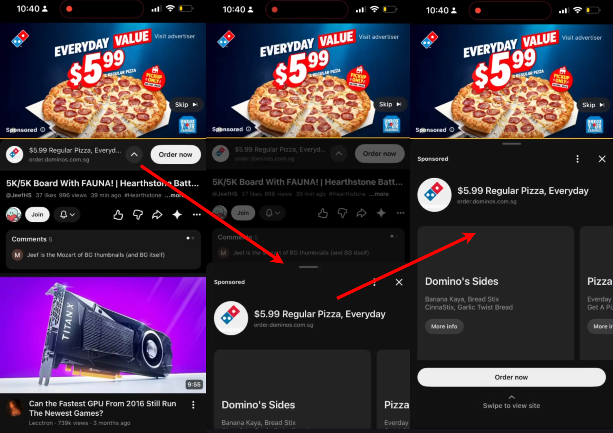

In class, we narrowed our choices down to around five mobile applications. Each of us then chose an application to research independently before meeting online on Thursday night to discuss our findings.

The app I chose was mobile Discord. Immediately as the app rose to mind, I feel I use it a lot but I did not really like it. Upon taking a closer look though, I realized that the app is actually quite good, and I could not find any painpoints.
My main complaint was about utilization of screen space, where I sometimes want to see the channel list and the active chat at the same time, but the app does not allow that. However, I realize after some research that few people actually complain about this, and I myself also do not have this problem most of the time.

I encountered a similar issue when examining YouTube. There were several small interactions that annoyed me. An interesting example would be the pre-video ad, where the small banner had an arrow that points upwards. A common user expectation would be for any element to move "from the arrow", for example browser arrows, app sidebars, etc. Hence, I had the expectation of the arrow closing the small banner. Instead, it pulled up a full page ad, which rose from the bottom of the screen, detached from the element containing the arrow. This goes against the user expectation, and is a small annoyance. Although this was an interesting UX inconsistency, it still felt too minor to become the focus of the project.

This became an important challenge during our discussion: how do we distinguish a minor inconvenience from a meaningful pain point? We realised that simply finding something imperfect was not enough. The issue should occur in an important part of the user's workflow and create enough friction that redesigning it would provide meaningful value.

We eventually examined Karen's choice, Google Docs. Her initial observation concerned the difficulty of highlighting text on mobile. Cleo and I did not consider highlighting central to our own usage, so we continued exploring rather than immediately committing to it.
While navigating the interface, we noticed a more relatable problem: the implementation of document outlines and tabs. Both are particularly useful for navigating longer documents and collaborative work. We were in fact, using them on desktop during our own meeting. On mobile, however, opening these navigation tools prevents users from simultaneously viewing the document itself. This weakens much of their usefulness, since the purpose of an outline or tab structure is to provide context while navigating content.

The biggest insight from this stage was that identifying a design problem requires moving beyond personal preference. Our strongest candidate emerged not from the first complaint we noticed, but through comparison, discussion, and questioning whether each issue genuinely interfered with an important user task.